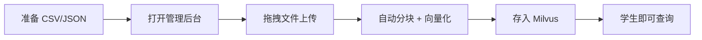

# HKBU 智能助手 — Telegram 机器人

> 基于 LangGraph + Milvus RAG + FastAPI 的 Telegram 智能助手中台

[](https://www.docker.com/)
[](https://www.python.org/)
[](https://langchain-ai.github.io/langgraph/)
[](LICENSE)

---

## 📖 目录

- [📖 目录](#-目录)
- [👥 项目简介](#-项目简介)
- [👤 用户功能指南](#-用户功能指南)
  - [1. 智能对话](#1-智能对话)
  - [2. 课程查询](#2-课程查询)
  - [3. 图片转视频](#3-图片转视频)
  - [4. PDF 文档分析](#4-pdf-文档分析)
- [👨‍💻 管理员功能指南](#-管理员功能指南)
  - [1. Web 管理后台](#1-web-管理后台)
  - [2. API 接口](#2-api-接口)
- [🚀 快速开始](#-快速开始)
- [🏗️ 技术架构](#️-技术架构)
- [📁 项目结构](#-项目结构)
- [📦 部署与运维](#-部署与运维)
- [🔧 配置说明](#-配置说明)
- [❓ 常见问题](#-常见问题)

---

## 👥 项目简介

本项目是为 HKBU 学生打造的 **Telegram 智能助手中台**，具备以下核心能力：

| 功能 | 技术实现 | 说明 |
|------|----------|------|
| 🤖 **AI 对话** | LangGraph + ChatGPT + Redis 队列 | 状态机驱动的多轮对话，意图自动分类，**Redis 队列削峰填谷（0 拒绝）** |
| 🧠 **对话记忆** | Milvus 向量记忆库 | 每次对话自动存入向量库，下次检索注入 prompt，跨会话持久化 |
| 📚 **课程查询** | Milvus Hybrid RAG | 语义检索（课程代码 + 课程名称），支持 CSV/JSON 数据导入与 PDF 自动入库 |
| 🎬 **图片转视频** | SiliconFlow Wan-AI + Celery | 图片分析 + AI 推荐动画 prompt + 后台生成 |
| 📄 **文档分析** | PyMuPDF + Milvus RAG | PDF 文本提取 + **caption 指令解析**（指定范围）+ 分块入库后语义检索针对性回答 |
| 🛡️ **高可用保护** | 熔断器 + 重试 + 限流 + Redis 队列 | LLM 熔断（5次失败切30s）、3次指数退避重试、每用户速率限制、Redis 队列削峰填谷、全局并发节流、Milvus 断连自动重建、Docker healthcheck |
| 🖥️ **管理后台** | FastAPI + Web UI | 程序员通过浏览器上传课程数据 |

---

## 👤 用户功能指南

### 1. 智能对话

**用法**：直接发送文字消息

```
你: 你好
Bot: 你好！我是 HKBU 课程助手，可以帮你查询课程信息...

你: 给我讲讲云计算
Bot: 云计算是通过互联网提供计算资源的服务模式...
```

**特点**：
- ✅ 自然语言理解
- ✅ **跨会话记忆**：每次对话自动存入 Milvus 向量库，下次相关提问时自动检索历史，实现长期记忆
- ✅ 学生助手角色定制

---

### 2. 课程查询

**用法**：发送课程代码（格式：4 字母 + 4 数字）或课程名称

```
你: COMP7940 什么时候上课？
Bot: COMP7940（AI and Chatbot Development）上课时间是
     周一 14:30-17:15，地点在 DLB 514

你: 这周 Cloud Computing 有什么作业要交？
Bot: COMP7930（Big Data Analytics）的作业：
     - Assignment 1（截止：2025-04-20）
       要求：Docker 部署大数据分析管道
```

**特点**：
- ✅ 自动识别课程代码（`COMP7940` 格式）
- ✅ **支持课程名称自然语言查询**（如 "Cloud Computing"、"云计算"）
- ✅ 语义检索自动匹配最相关课程
- ✅ 查询上课时间和地点
- ✅ 查看作业要求和截止日期
- ✅ 未找到课程时诚实告知，不编造

**数据来源**：管理员通过 Web 管理后台上传 CSV/JSON → 自动存入 Milvus 向量库；用户上传的 PDF 文档经 AI 分析后自动入库

---

### 3. 图片转视频

**用法**：发送 `/video` 命令，然后上传图片

```
Step 1: 发送 /video
Bot: 🎬 图片转视频模式
     第一步：请发送一张图片

Step 2: 上传图片
Bot: ✅ 已收到图片！
     🤖 AI 分析：这是一张海滩日落照片...
     
     建议的动画效果：
     1. 从全景平滑缩放到特写
     2. 从左到右平移展示海岸线
     3. 波浪涌动效果增加真实感
     
     💡 快捷选择：发送 1、2 或 3
     ✏️ 或输入你自己的动画描述

Step 3: 选择或输入动画效果
你: 1

Bot: 🎬 视频生成已开始！
     ✅ 你的视频正在后台处理中，请稍候...
     💬 等待时可以继续和我聊天

[2-10 分钟后]
Bot: ⏳ 你的视频在队列中（位置：2）
Bot: 🎬 你的视频正在生成中...
Bot: ✅ 视频已生成！正在上传...
Bot: [发送视频] 🎥 你的视频已就绪！
```

**特点**：
- ✅ AI 自动分析图片内容
- ✅ 智能推荐 3 种动画效果
- ✅ 支持自定义动画描述
- ✅ 后台生成，不阻塞对话
- ✅ 实时状态更新

**支持的图片格式**：JPG/JPEG、PNG、GIF、WebP

---

### 4. PDF 文档分析

**用法**：发送 PDF 文件，可附带文字指令指定解析范围

```
你: [发送 PDF 文件 + caption "总结第三章"]
Bot: 📄 正在分析文档...（背景处理后自动回复）

Bot: 📝 **分析结果**
     ✅ 已提取 PDF 全文（35 页）
     
     **第三章核心内容：**
     3.1 Docker 容器化基础
     3.2 Dockerfile 编写最佳实践
     3.3 docker-compose 多容器编排
     3.4 CI/CD 集成与自动化部署
     
     ⏰ 涉及截止日期：
     - 实验三：2025-04-10
     - 项目 Milestone 2：2025-04-20
```

也可以不附带指令，系统会自动提取关键信息：

```
你: [发送 PDF 文件，无 caption]
Bot: 📝 **文档分析结果**
     📄 文件：COMP7940_Syllabus.pdf
     
     核心课程目标：
     - 理解云计算基础和架构
     - 掌握 Docker 容器化技术
     ...
```

**特点**：
- ✅ **同轮问答**：上传时附带 caption（如"只分析第三章"），AI 提取全文后直接回答，无需第二轮对话
- ✅ **语义检索针对性回答**：PDF 全文分块入库后，仅检索与用户问题相关的 Top-5 块送入 LLM，而非硬塞全文
- ✅ 自动提取全文（支持任意页数 PDF）
- ✅ 识别关键信息（截止日期、要求等）
- ✅ **内容自动入库 Milvus RAG 知识库**：后续可通过语义检索直接查询 PDF 中的知识，无需重复上传
- ✅ **本轮对话存入记忆**：LLM 回复后自动持久化，后续提问可引用上下文

**注意**：
- ⚠️ 仅支持 PDF 格式
- ⚠️ 不支持图片 OCR
- ⏱️ 处理时间约 1-2 分钟（含 OCR 提取 + LLM 回答）

---

## 👨‍💻 管理员功能指南

### 1. Web 管理后台

管理员通过浏览器访问 `http://localhost:8000/admin`，使用图形化界面管理课程数据。

**操作流程**：



**界面功能**：

| 区域 | 功能说明 |
|------|----------|
| 📤 上传文件 | 拖拽或点击选择 CSV/JSON 文件 |
| ✏️ JSON 编辑 | 直接在文本框粘贴 JSON 数据 |
| 📋 上传结果 | 显示上传记录（成功/失败/数量） |
| 📊 Milvus 统计 | 查看已存储的课程数据分布 |
| 💡 模板参考 | 查看 CSV 和 JSON 的格式示例 |

**示例 CSV**：

```csv
course_code,course_name,class_time,location,description
COMP7940,AI and Chatbot Development,"Monday 14:30-17:15",DLB 514,AI-powered chatbot development
COMP7930,Big Data Analytics,"Wednesday 09:00-11:45",ACB 302,Big data processing with Spark
```

### 2. API 接口

也可以通过 `curl` 等工具直接调用 API：

```bash
# 上传课程数据
curl -X POST http://localhost:8000/api/upload \
  -F "file=@courses.csv" \
  -F "source_type=courses"

# 注入 JSON 数据
curl -X POST http://localhost:8000/api/ingest \
  -H "Content-Type: application/json" \
  -d '{"source_type": "courses", "data": [{"course_code": "COMP7940", "course_name": "AI"}]}'

# 查看统计
curl http://localhost:8000/api/stats
```

详细 API 文档见 [API_DOCS.md](API_DOCS.md)。

---

## 🚀 快速开始

### 前置条件

- Docker Desktop（Windows/Mac）或 Docker Engine（Linux）
- Docker Compose v2.0+
- 可用内存 8 GB+（Milvus 需要 ~2 GB）
- 必要的 API 密钥（见下方）

### 一键部署

```bash
# 1. 配置 API 密钥
# 编辑 config.ini，填入你的密钥

# 2. 启动所有服务
docker-compose up -d

# 3. (可选) 将示例课程数据灌入 Milvus
docker-compose exec bot python -m rag.ingest

# 4. 查看日志
docker-compose logs -f
```

部署完成后：

| 服务 | 地址 | 说明 |
|------|------|------|
| Telegram 机器人 | 你的 Bot | 用户端 |
| 管理后台 | http://localhost:8000/admin | 程序员端 |
| Milvus | localhost:19530 | 向量数据库 |

### 所需 API 密钥

| 服务 | config.ini 字段 | 获取方式 |
|------|-----------------|----------|
| 🤖 **Telegram Bot Token** | `[TELEGRAM]` / `ACCESS_TOKEN` | [@BotFather](https://t.me/botfather) |
| 🧠 **Azure OpenAI** | `[CHATGPT]` | HKBU GenAI Gateway |
| 🎬 **SiliconFlow** | `[WAN_AI]` | [siliconflow.cn](https://siliconflow.cn) |
| 🗄️ **PostgreSQL** (可选) | `[DATABASE]` | Neon / 自建 |

### 快速灌入示例数据

项目包含示例课程数据，启动后可以执行：

```bash
# 通过管理后台上传 CSV 数据
# 打开 http://localhost:8000/admin
# 拖拽 data/courses.csv 和 data/assignments.csv 上传

# 或通过 CLI 直接灌入（推荐用于初始化）
docker-compose exec bot python -m rag.ingest
```

---

## 🏗️ 技术架构

### 系统架构图

```
Telegram 用户                    管理员浏览器
     │                              │
     ▼                              ▼
┌─────────────────┐     ┌──────────────────────┐
│  Bot Agent      │     │  FastAPI Admin        │
│  (LangGraph)    │     │  (Web 管理后台)        │
└────────┬────────┘     └──────────┬───────────┘
         │                        │
         ▼                        ▼
┌───────────────────────────────────────────────┐
│               LangGraph StateGraph             │
│                                               │
│  classify_intent                               │
│    ├── video_command     → 视频工作流          │
│    ├── retrieve_course   → Milvus Hybrid RAG   │
│    ├── general_chat      → Redis 队列 → RAG     │
│    │                      → 记忆 → LLM        │
│    └── analyze_document  → Celery OCR + 入库   │
│                           → RAG (skip 记忆)    │
└───────────────┬───────────────────────────────┘
                │
         ┌──────┴──────┐
         ▼             ▼
    ┌───────┐    ┌───────┐
    │Redis  │    │Milvus │
    │(队列)  │    │(向量库)│
    └───┬───┘    └───┬───┘
        │            │
        ▼            ▼
┌──────────────────────────────┐
│  Celery Workers                │
│  ┌────────────┐  ┌────────┐  │
│  │ Video      │  │  OCR   │  │
│  │ x10 (×2)   │  │  x20   │  │
│  │ =20 并发   │  │  (×4)  │  │
│  │            │  │ =80并  │  │
│  └────────────┘  └────────┘  │
└──────────────────────────────┘
```

### 技术栈

| 层次 | 技术 | 用途 |
|------|------|------|
| **编排引擎** | LangGraph StateGraph | 状态机驱动的多轮对话，条件路由 |
| **RAG 检索** | LangChain + Milvus + OpenAI Embeddings | 语义向量检索 |
| **机器人框架** | python-telegram-bot 22.5 | Telegram 消息处理 |
| **AI 对话** | Azure OpenAI (ChatGPT) | LLM 对话和内容生成 |
| **视频生成** | SiliconFlow Wan-AI API | 图片转视频 |
| **任务队列** | Celery + Redis | 后台耗时任务调度 |
| **管理后台** | FastAPI + Bootstrap 5 | 数据管理 Web 界面 |
| **向量数据库** | Milvus | 课程RAG + 对话记忆 |
| **异步 HTTP** | httpx | 非阻塞 API 调用 |
| **容器化** | Docker + Docker Compose | 一键部署 |

### 核心设计理念

| 理念 | 说明 |
|------|------|
| **状态驱动** | 所有业务逻辑由 LangGraph StateGraph 编排，AgentState 传递完整上下文 |
| **异步非阻塞** | 全链路 async/await，单进程高并发 |
| **混合检索** | BM25 稀疏匹配 + Milvus 稠密向量 RRF 融合 |
| **阈值安全** | RAG 相似度 < 0.5 时如实告知，不编造课程信息 |
| **熔断保护** | LLM 连续 5 次失败开启熔断器，30s 后自愈，防止雪崩 |
| **速率限制** | 每用户 30 次/分钟滑动窗口 + 全局 50 并发节流，防滥用 |
| **自动恢复** | Milvus 断连自动重建 TTL 连接，Celery 任务 3 次重试 |
| **松耦合** | 各组件通过消息队列/API 通信，可独立扩缩容 |

---

## 📁 项目结构

```
Multi-functional_AI_Assistant/
│
├── app/                             # 主程序包
│   ├── __init__.py
│   ├── bot.py                       # Telegram 机器人主程序（LangGraph 驱动）
│   ├── llm.py                       # Azure OpenAI 客户端（熔断器+重试）
│   ├── video.py                     # 视频生成器（SiliconFlow API）
│   ├── api.py                       # FastAPI 管理后台服务
│   │
│   ├── configs/
│   │   ├── __init__.py
│   │   └── settings.py              # Pydantic 配置管理
│   │
│   ├── graph/
│   │   ├── __init__.py
│   │   ├── state.py                 # AgentState 类型定义
│   │   ├── nodes.py                 # LangGraph 节点函数（11 个节点）
│   │   └── workflow.py              # StateGraph 构建与编译
│   │
│   ├── rag/
│   │   ├── __init__.py
│   │   ├── retriever.py             # 混合检索（BM25+稠密+RRF）+ 对话记忆
│   │   ├── ingest.py                # CSV → Milvus 数据灌入
│   │   ├── ingest_documents.py      # PDF/文档灌入工具
│   │   └── parse_courses.py         # CSV/JSON 解析 → Milvus
│   │
│   └── api_templates/
│       └── index.html               # Web 管理后台页面
│
├── workers/                          # Celery 工作进程
│   ├── __init__.py
│   ├── tasks.py                      # 视频生成/OCR/图片分析任务
│   └── entry.py                      # Worker 启动入口
│
├── data/
│   ├── courses.csv                   # 课程数据示例
│   └── assignments.csv               # 作业数据示例
│
├── docker-compose.yml                # 容器编排（10 个服务）
├── Dockerfile                        # Docker 镜像定义
├── requirements.txt                  # Python 依赖清单
├── config.ini                        # 配置文件（API 密钥等）
├── ARCHITECTURE.md                   # 系统架构文档
├── API_DOCS.md                       # 数据管理接口文档
└── README.md                         # 本文件
```

---

## 📦 部署与运维

### 本地部署

```bash
# 启动所有服务
docker-compose up -d

# 查看日志
docker-compose logs -f

# 查看特定服务日志
docker-compose logs -f bot
docker-compose logs -f api

# 停止服务
docker-compose down

# 重启服务
docker-compose restart
```

### Worker 扩缩容

```bash
# 增加视频 worker 到 5 个
docker-compose up -d --scale video_worker=5

# 减少 OCR worker 到 2 个
docker-compose up -d --scale ocr_worker=2
```

### 性能指标

| 服务 | 副本 | CPU 限制 | 内存限制 |
|------|------|----------|----------|
| Bot | 1 | - | - |
| API | 1 | - | - |
| Redis | 1 | - | - |
| Milvus Stack | 3 (etcd+minio+milvus) | - | ~2G |
| Video Worker | 10 | 2 | 2G |
| OCR Worker | 20 | 2 | 2G |

**并发容量**：
- 💬 对话：无限制（异步非阻塞）
- 🎬 视频生成：20 个并发（10 副本 × 2 concurrency）
- 📄 文档分析：80 个并发（20 副本 × 4 concurrency）

### 数据备份

```bash
# 备份 Redis
docker-compose exec redis redis-cli SAVE

# 备份配置
cp config.ini config.ini.backup

# 备份 Milvus 数据
docker-compose exec milvus tar czf /tmp/milvus_backup.tar.gz /var/lib/milvus
docker cp chatbot_milvus:/tmp/milvus_backup.tar.gz ./
```

---

## 🔧 配置说明

### config.ini 完整配置项

```ini
[TELEGRAM]
ACCESS_TOKEN = telegram_bot_token

[CHATGPT]
API_KEY = your_azure_openai_key
BASE_URL = https://genai.hkbu.edu.hk/api/v0/rest
MODEL = gpt-4o-mini
API_VER = 2024-12-01-preview


[WAN_AI]
API_KEY = your_siliconflow_key
BASE_URL = https://api.siliconflow.cn/v1
MODEL = Wan-AI/Wan2.2-I2V-A14B
```

### 环境变量覆盖

以上配置项均可通过同名环境变量覆盖，优先级：**环境变量 > config.ini**

| 环境变量 | 默认值 | 说明 |
|----------|--------|------|
| `MILVUS_HOST` | `milvus` | Milvus 主机（Docker 内部） |
| `MILVUS_PORT` | `19530` | Milvus 端口 |
| `REDIS_HOST` | `redis` | Redis 主机 |
| `REDIS_PORT` | `6379` | Redis 端口 |
| `EMBEDDING_API_KEY` | 复用 CHATGPT | 嵌入模型 API 密钥 |
| `EMBEDDING_MODEL` | `text-embedding-3-small` | 嵌入模型名称 |

---

## ❓ 常见问题

**Q: 视频生成需要多久？**
A: 通常 2-10 分钟，最长 50 分钟（取决于 API 队列）。

**Q: 如何更改机器人的回复风格？**
A: 编辑 `ChatGPT_HKBU.py` 中的 `self.system_message`。

**Q: 需要自己搭建数据库吗？**
A: 不需要。所有数据（课程信息、对话记忆）都存储在 Milvus 向量库中，无需额外数据库。

**Q: 如何添加新的课程数据？**
A: 打开 http://localhost:8000/admin，拖拽 CSV/JSON 文件上传即可，或通过 `curl` 调用 API。

**Q: Milvus 连接失败怎么办？**
A: 检查 `docker-compose ps` 确认 milvus、etcd、minio 三个容器都在运行。

**Q: 机器人有长期记忆吗？**
A: 是的。每次对话都会自动存入 Milvus 向量库的 `conversation_memory` 集合中。当用户下次发送消息时，系统会自动检索相关的历史对话（语义相似度），并将其注入到 LLM 的 prompt 中，实现跨会话的记忆持久化。记忆按用户隔离，不同用户之间的记忆互不可见。

**Q: 为什么我查询不存在的课程时，机器人会说"不知道"？**
A: 这是正常的安全设计。当 RAG 检索结果低于相似度阈值（0.5）时，系统会告知 LLM "没有找到相关信息，不要编造"，避免张冠李戴。

**Q: 支持用课程名称查询吗？**
A: 支持。现在你直接输入课程名称（如 "Cloud Computing"、"云计算"），系统会自动进行语义检索，命中 Milvus 中的课程信息并返回相关结果。也支持用课程代码（如 COMP7940）查询。

**Q: 机器人有速率限制吗？会被滥用吗？**
A: 有。系统内置了多层防护：每用户每分钟最多 30 条消息（滑动窗口），全局最多 50 个并发请求，单条消息最长 4096 字符。此外还有 LLM 熔断保护：如果 AI 接口连续 5 次失败，会自动切断 30 秒防止雪崩。

**Q: 如果某个服务挂了怎么办？**
A: 各组件都有独立的故障处理策略：
- **LLM 宕机** → 熔断器 30s 自愈 + 3 次重试（2s→4s→8s 退避）
- **Milvus 宕机** → TTL 缓存 5 分钟后自动重建连接

- **Redis 宕机** → Celery 暂停，AOF 持久化恢复后队列不丢
- **Docker 崩溃** → `restart: unless-stopped` 自动重启

**Q: 如何查看运行日志？**
A: `docker-compose logs -f` 查看所有日志，或 `docker-compose logs -f bot` 查看特定服务。

---

## 📚 相关文档

| 文档 | 说明 |
|------|------|
| [ARCHITECTURE.md](ARCHITECTURE.md) | 详细系统架构文档 |
| [API_DOCS.md](API_DOCS.md) | FastAPI 接口文档 |

---

## 📄 许可证

本项目仅用于教育和研究目的。

---

**Made with ❤️ for HKBU Students**
