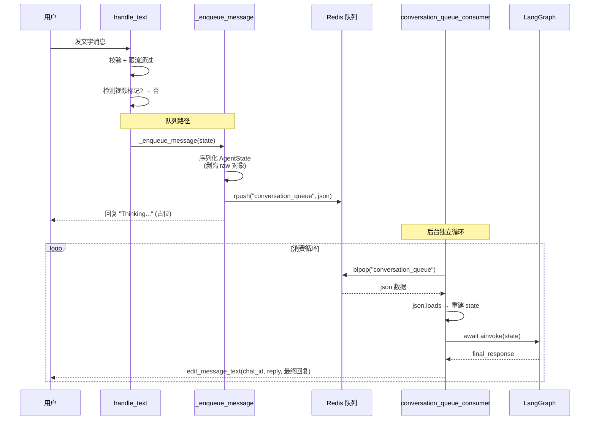

<<<<<<< HEAD
# 技术面试文档 — HKBU 智能助手中台

> 本文档用于技术面试准备，涵盖系统架构、核心设计决策、关键技术实现和最近更新。

---

## 目录

- [1. 项目概述](#1-项目概述)
- [2. 系统架构](#2-系统架构)
- [3. 核心设计决策](#3-核心设计决策)
- [4. LangGraph 状态机](#4-langgraph-状态机)
- [5. RAG 检索系统](#5-rag-检索系统)
- [6. 技术亮点](#6-技术亮点)
- [7. 最新变更（v2.0）](#7-最新变更v20)

---

## 1. 项目概述

HKBU 智能助手是一个基于 **LangGraph + Milvus RAG + FastAPI** 的 Telegram 智能助手中台，面向香港浸会大学学生提供课程查询、文档分析和 AI 对话服务。

| 功能 | 技术栈 | 说明 |
|------|--------|------|
| **AI 对话** | LangGraph + ChatGPT | 状态机驱动的多轮对话，意图自动分类 |
| **对话记忆** | Milvus 向量记忆库 | 跨会话持久化，语义检索历史注入 prompt |
| **课程查询** | Milvus Hybrid RAG | 支持课程代码和课程名称自然语言查询 |
| **PDF 分析** | PyMuPDF + ChatGPT + Milvus | 文本提取 + 纯文本提取 + 自动入库 RAG 知识库 |
| **图片转视频** | SiliconFlow Wan-AI + Celery | 图片分析 + 后台视频生成 |
| **高可用** | 熔断器 + 重试 + 限流 | LLM 熔断保护、用户速率限制、自动连接恢复 |

---

## 2. 系统架构

```
                    ┌──────────────────────┐
                    │   Telegram 客户端      │
                    │   (用户/学生)          │
                    └──────────┬───────────┘
                               │  HTTP Polling
                               ▼
┌──────────────────────────────────────────────────────────────────┐
│                     Bot Agent (python-telegram-bot)               │
│  ┌───────────────────────────────────────────────────────────┐   │
│  │               LangGraph StateGraph                          │  │
│  │                                                             │  │
│  │  classify_intent → intent_router                            │  │
│  │    ├── video_command    → 视频工作流 (set flags) → END      │  │
│  │    ├── retrieve_course  → retrieve_rag                      │  │
│  │    ├── general_chat     → retrieve_rag                      │  │
│  │    │                      │                                 │  │
│  │    │                      ▼                                 │  │
│  │    │              retrieve_memory (Milvus 对话记忆)          │  │
│  │    │                      │                                 │  │
│  │    │                      ▼                                 │  │
│  │    │              build_prompt (RAG + 记忆 + 用户消息)       │  │
│  │    │                      │                                 │  │
│  │    │                      ▼                                 │  │
│  │    │                ┌─────┴──────┐                           │  │
│  │    │                │ Azure      │  ← 外部 LLM API           │  │
│  │    │                │ OpenAI     │                           │  │
│  │    │                │ (ChatGPT)  │                           │  │
│  │    │                └─────┬──────┘                           │  │
│  │    │                      ▼                                 │  │
│  │    │              store_memory (Milvus) → END                │  │
│  │    │                                                         │  │
│  │    ├── general_chat     → Redis 队列 → 后台 worker → RAG  │  │
│  │    ├── analyze_document → Celery OCR + await 入库 → retrieve_rag  │  │
│  │    │                       → LLM 对话（回答 caption 指令）            │  │
│  │    └── receive_video_*  → Celery 视频生成 → END              │  │
│  └───────────────────────────────────────────────────────────┘   │
└──────────────────────────────────────────────────────────────────┘
           │                    │                 │
           ▼                    ▼                 ▼
    ┌────────────┐      ┌────────────┐    ┌──────────────┐
    │  Milvus    │      │   Redis    │    │  FastAPI     │
    │  向量库     │      │  Celery    │    │  管理后台    │
    │            │      │  Broker    │    │  (管理员)    │
    │ course_    │      └─────┬──────┘    └──────────────┘
    │ documents  │            │
    │ conv_      │            ▼
    │ memory     │    ┌─────────────────────────────────────────┐
    └────────────┘    │  Celery Worker 集群                      │
                      │                                         │
                      │  ┌────────────────┐ ┌────────────────┐  │
                      │  │ Video Worker   │ │ OCR Worker     │  │
                      │  │ x10 副本       │ │ x20 副本       │  │
                      │  │ ×2 concurrency │ │ ×4 concurrency │  │
                      │  │ =20 总并发     │ │ =80 总并发     │  │
                      │  └────────────────┘ └────────────────┘  │
                      └─────────────────────────────────────────┘

   ──→ LLM API 调用路径
   ──→ 内部数据流
   ──→ Celery 异步任务
```

---

## 3. 核心设计决策

### 3.1 为什么选择 LangGraph？

| 对比项 | LangGraph | 传统状态机 | LLM-only 路由 |
|--------|-----------|------------|---------------|
| **状态管理** | 内置 TypedDict，类型安全 | 需手动维护 | 上下文窗口限制 |
| **可观测性** | 每步状态可追踪 | 日志级别 | 黑盒 |
| **条件路由** | 函数式 router，可扩展 | 硬编码 | 依赖 LLM 判断 |
| **异步支持** | 原生 async/await | 需包装 | 天然异步 |

**结论**：LangGraph 提供了结构化状态管理 + 精确条件路由 + 完全的异步支持，比传统状态机灵活、比纯 LLM 路由可控。

### 3.2 为什么用 Milvus 做 RAG 而不是 PostgreSQL？

| 对比项 | Milvus | PostgreSQL (pgvector) |
|--------|--------|----------------------|
| **向量检索性能** | 毫秒级（10M+ 向量） | 秒级（百万级别降速） |
| **混合检索** | BM25 + Dense + RRF 原生支持 | 需自建 |
| **扩展性** | 分布式原生 | 需插件 |
| **对话记忆** | 独立 collection 隔离 | 需额外表 |

**策略**：Milvus 统一承载课程数据 + 对话记忆 + 用户 PDF，**零外部数据库依赖**。

### 3.3 RAG 阈值过滤

```
相似度 ≥ 0.5 → 正常使用 RAG 结果
相似度 < 0.5 → rag_empty=True → prompt 注入"不要编造"指令
```

**为什么是 0.5？** 基于 cosine similarity 分布：
- 同类课程间 ≥ 0.7
- 部分相关 0.4-0.6
- 无关查询 < 0.3

0.5 是经验值，在高召回（避免遗漏）和低误报（避免无关）之间取得平衡。

---

## 4. LangGraph 状态机

### 4.1 节点注册表

| 节点 | 函数 | 类型 | 说明 |
|------|------|------|------|
| `classify_intent` | `classify_intent_node` | sync | 意图分类 |
| `video_command` | `video_command_node` | sync | 初始化视频工作流 |
| `receive_video_image` | `receive_video_image_node` | async | 接收图片 |
| `receive_video_prompt` | `receive_video_prompt_node` | async | 接收 prompt |
| `retrieve_rag` | `retrieve_rag_node` | async | Milvus 语义检索 |
| `retrieve_memory` | `retrieve_conversation_memory_node` | async | 对话记忆检索 |
| `build_prompt` | `build_prompt_node` | sync | 组装 LLM 提示词 |
| `call_llm` | `call_llm_node` | async | ChatGPT API 调用 |
| `store_memory` | `store_conversation_memory_node` | async | 记忆存入 Milvus |
| `analyze_document` | `analyze_document_node` | async | PDF 文档分析 + 入库 |

### 4.2 意图分类优先级

```
1. user_data["waiting_for_video_prompt"] → receive_video_prompt
2. user_data["waiting_for_video_image"]  → receive_video_image
3. msg.startswith("/video")               → video_command
4. re.search(r"[A-Z]{4}\d{4}", msg)       → retrieve_course (课程代码)
5. 默认 (含自然语言课程查询)               → general_chat → retrieve_rag
```

### 4.3 路由对比（v1.0 vs v2.0）

| 意图 | v1.0 路由 | v2.0 路由 | 变化说明 |
|------|-----------|-----------|---------|
| `retrieve_course` | `retrieve_rag` | `retrieve_rag` | 不变 |
| `general_chat` | `retrieve_memory` | `retrieve_rag` → `retrieve_memory` | **新增 RAG** |
| `analyze_document` | `analyze_document → END` | `analyze_document → retrieve_rag → LLM（skip_memory）` + await 入库 | **RAG 语义检索 + skip_memory** |

---

## 5. RAG 检索系统

### 5.1 混合检索（Hybrid Search）

```
用户查询： "COMP7940 什么时候截止"
          │
    ┌──────┴──────┐
    │             │
┌─────────┐  ┌─────────┐
│  BM25   │  │  Dense  │
│  稀疏    │  │  稠密   │
│  精确匹配 │  │  语义检索 │
└────┬────┘  └────┬────┘
    │             │
    └──────┬──────┘
           │
    ┌──────┴──────┐
    │  RRF 融合    │
    │  score =     │
    │  0.3×1/(60+r₁)│
    │  +0.7×1/(60+r₂)│
    └──────┬──────┘
           │
    ┌──────┴──────┐
    │  阈值 ≥ 0.5  │
    │  top-5 返回  │
    └─────────────┘
```

### 5.2 为什么 BM25 + Dense 而不是纯 Dense？

| 场景 | 纯 Dense | Hybrid (Ours) |
|------|---------|---------------|
| "COMP7940 deadline?" | 代码向量不常见，排名低 | BM25 精确命中 "COMP7940" |
| "作业什么时候交？" | 语义泛化可能偏移 | "作业" 关键词 + "deadline" 语义 |
| "NLP transformer" | 需 embedding 训练过 | BM25 精确匹配 |

### 5.3 数据灌入流程

```
管理员上传 CSV/JSON → FastAPI → 解析 → 分块 (500 chars, 50 overlap)
                                              ↓
                                        OpenAI Embedding
                                              ↓
                                        Milvus 向量库

用户上传 PDF → Telegram → analyze_document_node
                                         ↓
                               Celery 提取全文
                                         ↓
                               ingest_text() → 分块 → 入库
```

---

## 6. 技术亮点

### 6.1 混合检索 RRF 融合算法

```python
score(d) = sparse_weight × 1/(K_RRF + rank_sparse(d))
         + dense_weight  × 1/(K_RRF + rank_dense(d))
```

- `K_RRF = 60`：控制排名衰减速度
- `sparse_weight = 0.3`：BM25 关键词权重
- `dense_weight = 0.7`：语义向量权重
- 当 BM25 不可用时自动回退纯 Dense

### 6.2 熔断器设计

```
CLOSED (正常)
  → 连续 5 次 LLM 调用失败
  → OPEN (30 秒内所有请求直接拒绝)
  → 30 秒后 HALF_OPEN (放行 1 个试探)
  → 成功则 CLOSED，失败则重回 OPEN
```

### 6.3 水平扩展设计

- **Bot**：纯 async，单进程高并发，可多实例部署
- **Worker**：视频生成 10 副本 × 2 并发 = 20 总并发；OCR/文档分析 20 副本 × 4 并发 = 80 总并发。通过 `docker-compose up --scale` 弹性扩缩
- **LLM**：Azure OpenAI ChatGPT 外部 API，通过熔断器 + 重试应对限流和服务抖动
- **Milvus**：支持单节点 → 分布式 → Zilliz Cloud 无缝升级
- **数据库**：全部托管在 Milvus，消除多数据源一致性问题

---

## 7. 最新变更（v2.0）

### 7.1 general_chat 统一走 RAG 检索

**改动文件**：`app/graph/workflow.py`

```python
# 之前
"general_chat": "retrieve_memory"

# 之后
"general_chat": "retrieve_rag"
```

**动机**：用户输入课程名称（如 "Cloud Computing"）而非课程代码时，通过语义检索自动命中 Milvus 中的课程信息。

**效果**：
- 支持 "Cloud Computing 什么时候上课" 类型自然语言查询
- 普通闲聊不受影响（无相关 → rag_context 为空 → prompt 中没有课程信息）
- 与 `retrieve_course` 路径复用相同的 `retrieve_memory → build_prompt → call_llm` 下游

### 7.2 PDF 内容自动入库 Milvus

**改动文件**：
- `workers/tasks.py` — `analyze_document_task` 返回 `extracted_text`
- `app/graph/nodes.py` — `analyze_document_node` 同步 `await ingest_text()`

**数据流**：

```
用户上传 PDF → Celery PyMuPDF 提取全文（无 AI 摘要）
                              ↓
analyze_document_node 收到结果
                              ↓
await ingest_text()  -- 同步等待入库完成
                              ↓
Milvus course_documents 集合 (source=user_upload_pdf)
                              ↓
后续 retrieve_rag 立即检索 PDF 知识
```

**设计要点**：
- 异步非阻塞：`asyncio.create_task` 不阻塞用户响应
- 元数据追踪：记录 `filename`、`user_id`、`source`
- 增量更新：与 CSV/JSON 导入的数据在同一个向量集合，统一检索

### 7.3 PDF 解析支持 caption 指令 + 同轮对话

**改动文件**：
- `app/bot.py` — `_route_document_analysis` 捕获 `update.message.caption`
- `app/graph/workflow.py` — `analyze_document → retrieve_memory`（之前 → END）
- `app/graph/nodes.py` — `analyze_document_node` 注入 `rag_context` 而非 `final_response`
- `app/graph/nodes.py` — `call_llm_node` 添加 `final_response` 短路保护

**动机**：用户上传 PDF 时无法指定解析范围（如"只分析第三章"），必须等全文档提取后在第二轮对话提问，但此时 PDF 原文已不在上下文中。

**改前 vs 改后**：

| 对比 | 改前 | 改后 |
|------|------|------|
| caption 处理 | 丢弃，硬编码 `[Document]: 文件名` | 保留为 `user_message`，传给 LLM |
| 路由 | `analyze_document → END` | `analyze_document → retrieve_rag → LLM（skip_memory）` |
| 返回方式 | 直接返回 Celery 摘要作为 `final_response` | 入库后 await → retrieve_rag 语义检索 |
| 回答能力 | 固定全文档摘要 | RAG 语义检索 + LLM 针对性回答 |
| 对话记忆 | 不存储（无 store_memory） | 存入 Milvus conversation_memory，可引用上下文 |

**数据流**：

```
用户上传 PDF + caption "只分析第三章"
  │
  ├── bot.py 捕获 caption → user_message = "[Document: 文件.pdf] 只分析第三章"
  │
  ├── analyze_document_node
  │   ├── Celery OCR 提取全文
  │   ├── await ingest_text() 入库（同步等待）
  │   ├── 清理 user_message（去掉 [Document:...] 前缀）
  │   └── 返回 {"user_message": "只分析第三章"}（不设 rag_context）
  │
  ├── retrieve_rag 语义搜索刚入库的 PDF chunks
  │   └── rag_context = Top-5 相关块
  │
  ├── retrieve_memory（对话历史）
  ├── build_prompt（rag_context + 记忆 + user_message）
  ├── call_llm → ChatGPT 回答"只分析第三章"
  ├── store_memory（存对话）
  │
  └── Bot 回复针对性的第三章分析结果
```

---

## 面试 Q&A

**Q1: 为什么用 LangGraph 而不是直接调用 ChatGPT？**

结构化状态管理（AgentState TypedDict）、精确条件路由（intent_router 函数而非 LLM 判断）、原生异步支持、每个节点的输入输出都可观测和调试。

**Q2: Milvus 挂了会怎样？**

RAG 检索失败 → `rag_context=""`, `rag_empty=True` → prompt 注入"没有课程信息" → LLM 如实告知不编造 → 5 分钟 TTL 缓存自动重建连接。对话功能不受影响，只是没有 RAG 上下文。

**Q3: 如何处理 LLM Token 限制？**

文档超过 8000 字符时，先分块（每块 3000 字符，200 重叠），每块独立摘要，再二次合成最终摘要。RAG 分块采用 500 字符 + 50 重叠。

**Q4: 大规模并发怎么办？**

Bot 通过 50 并发 asyncio.Semaphore 节流 + 每用户 30 次/分钟滑动窗口限流。Celery Worker 支持 Docker Compose --scale 水平扩展（视频 10 副本 x2=20 并发，OCR 20 副本 x4=80 并发）。

**Q5: 如何保证 RAG 结果准确？**

双引擎（BM25 精确 + Dense 语义）+ RRF 融合排序 + 0.5 阈值安全过滤 + 未命中时禁止 LLM 编造的 prompt 指令。

**Q6:“为什么不用纯 LangChain？Conversation memory 不也能用 LangChain 存入 Milvus 吗？”**

**A:** 纯 LangChain 确实可以实现对话记忆的存取，`VectorStoreRetrieverMemory` 可以直接把历史对话存进 Milvus、自动检索、自动注入 prompt。那为什么还要显式写成两个独立的 LangGraph 节点？

**核心矛盾在于：图结构需要的不是"自动注入"，而是"可控的读取时机"。**

LangChain 的 `VectorStoreRetrieverMemory` 设计假设是**每轮对话都应该读记忆**。它的注入发生在 chain 的隐式步骤中，开发者很难在中间插一脚说"这轮别读"。

但在我们的图里，`analyze_document` 路径明确标记了 `skip_memory = True`——PDF 分析时，用户的问题是围绕刚上传的文档展开的，历史对话不仅没用，反而可能干扰 LLM 的注意力。

```python
# 一行短路，零成本的条件跳过
if state.get("skip_memory"):
    return {"conversation_memory_context": ""}
```

**对比三种场景：**

| 场景 | LangChain 自动记忆 | LangGraph 显式节点 |
|------|-------------------|-------------------|
| 普通对话（`general_chat`） | ✅ 自动，省事 | ✅ 同样可以 |
| 课程查询（`retrieve_course`） | ⚠️ 记忆可能干扰课程检索 | ✅ `conversation_memory_context` 独立于 `rag_context`，互不影响 |
| PDF 分析（`analyze_document`） | ❌ 难以在 chain 中间"这轮跳过" | ✅ `skip_memory = True`，一行短路 |
| 自定义记忆注入格式 | ⚠️ 需继承 memory class 重写 | ✅ `build_prompt_node` 直接字符串拼接 |
| 调试时检视模型读到了什么 | ❌ 记忆是 chain 内部变量，不可见 | ✅ `conversation_memory_context` 是显式字段，每步可 log |

**总结**：不是 LangChain 做不到，而是 **LangGraph 的显式状态管理让"条件性跳过"成了零成本的原子操作**。在 LangChain 里，你要么接受每轮都读记忆、要么重写 memory class、要么在 chain 外包一层 if-else。在 LangGraph 里，`if state.get("skip_memory"): return` 就是三行代码——因为你控制的是**状态**，不是链路的执行顺序。加上图结构天然支持多路分叉后汇合（区别于 LangChain LCEL 的线性管道），以及多轮视频交互的中断恢复能力，LangGraph + LangChain 的组合是最优解。

**Q7: 项目中你遇见的难点是什么？有没有遇见什么瓶颈？**

**A:** 几个主要的难点：

**1. 意图分类的精确度**
一开始意图分类完全依赖 LLM 做 NLP 路由，但 Latency 太高（每次消息多 1-2s），而且 LLM 偶尔会误判。后来改为**正则 + 优先级硬编码**（`[A-Z]{4}\d{4}` 匹配课程代码），把 LLM 路由限制在真正需要语义理解的场景。这属于”用确定逻辑承载 90% 的流量，LLM 只兜底 10% 的边缘 case”的思路。

**2. 文档分析与对话的解耦问题**
初期 PDF 分析走到 `analyze_document → END`，用户 caption 被丢弃，必须第二轮对话才能追问内容。这是架构上的硬伤——**OCR 提取和 LLM 回答之间缺少”桥接”**。后来改为 OCR 节点注入 `rag_context` 后继续走对话 pipeline，实现同轮问答。这个改动涉及 bot.py（捕获 caption）、workflow.py（改边）、nodes.py（改返回值）三层，但每个文件改动量控制在 10 行以内——说明前期 LangGraph 的节点独立性设计是对的。

**3. 长文档的 Token 瓶颈**
OCR 提取的 PDF 动辄几万字。我们不直接塞全文，而是通过 **RecursiveCharacterTextSplitter(500/50)** 分块 → embedding → 入库 Milvus，再由 `retrieve_rag` 混合检索只取与用户问题相关的 Top-5 块送入 LLM，避免 Token 溢出。

**4. 混合检索的冷启动**
BM25 稀疏索引需要全量 dump Milvus 数据，首次构建耗时约 10-15s。为此加了 **10 分钟 TTL 缓存**（`_BM25_CACHE_TTL = 600`），缓存未命中时自动回退纯 Dense 检索，避免用户等待。

**Q8: 市面上有很多跟你这个项目差不多的，你的技术上的创新点是什么？**

**A:** 这个项目的差异化在于几个技术决策的组合：

**1. 混合检索的双引擎架构**
大多数竞品只用 Dense 向量检索（例如基于 `text-embedding-3-small` 的纯余弦相似度）。但课程代码 “COMP7940” 这种精确标识符在语义空间里是稀疏的——`”COMP7940”` 和 `”COMP7930”` 的 embedding 距离可能比 `”COMP7940”` 和 `”biology”` 还近。我们引入 **BM25 稀疏匹配 + Dense 语义检索 + RRF 加权融合**（`0.3 × BM25 + 0.7 × Dense`），精确命中课程代码，语义召回课程名称，两者互补：

| 场景 | 纯 Dense | 我们的 Hybrid |
|------|----------|---------------|
| `”COMP7940 deadline?”` | 代码向量不常见，排名靠后 | BM25 精确命中 `”COMP7940”`，排名 Top-1 |
| `”作业什么时候交？”` | 语义泛化可能偏移 | BM25 命中”作业”关键词 + Dense 命中 “deadline” |
| BM25 不可用时 | — | 自动回退纯 Dense |

**2. 状态机驱动的多轮交互（LangGraph）**
大部分 Bot 项目是简单的”用户消息 → LLM 回复”线性管道。我们基于 **LangGraph StateGraph** 编排了 5 类意图、11 个节点，涵盖视频生成（3 轮对话状态恢复）、PDF 分析（OCR 异步 + 汇入对话 pipeline）、RAG 检索后的阈值安全过滤（`rag_empty` 分支）。状态通过 `AgentState TypedDict` 强类型传递，每个节点可独立调试和测试。

**3. 全量 Milvus，零外部数据库**
课程数据、对话记忆、用户上传的 PDF 全部托管在 **同一个 Milvus 向量库**，不依赖 PostgreSQL 或其他关系数据库。这消除了多数据源一致性问题，部署时只需维护一个存储系统。RAG 检索和对话记忆使用相同的 embedding 模型（`text-embedding-3-small`），意味着用户的问题在语义空间中同时搜索课程知识和历史对话，统一排序。

**4. 文档的”上传即问答”**
竞品的文档分析通常是”上传 → 等待 → 看摘要”的单向流程。我们打通了 **OCR 提取 → 入库 → RAG 语义检索 → 对话 pipeline** 这条链路，用户上传 PDF 时附带 caption 即可指定解析范围，AI 在提取全文后直接回答具体问题，同时内容自动入库方便后续检索。整个过程在一次图执行中完成。

**Q9: 如果 Milvus 超出最大容量爆了怎么办？有没有紧急避险的处理功能？**

**A:** 我们做了多层防护：

**1. 请求层面的静默降级**
当 Milvus 连接失败或查询超时时，`retrieve_rag_node` 捕获异常并返回 `{“rag_context”: “”, “rag_empty”: True}`——**RAG 挂了，对话不挂**。`build_prompt_node` 检测到 `rag_empty=True` 后会注入安全指令：
```
Note: No relevant additional information was found in the knowledge base.
Do NOT make up details or assign information from a different source.
```
LLM 收到指令后会如实告知”没有相关信息”，而不是编造。这是第一道止损线。

**2. 连接缓存的自动重建**
`retriever.py` 实现了 **TTL 缓存**（`_CACHE_TTL = 300` 秒）：
- 正常时：5 分钟内复用同一个 Milvus 连接
- 失败时：`_invalidate_cache()` 立即清除缓存，**下一次请求自动重建**连接
- 如果重建也失败，保留旧连接作为 fallback（`if cached is not None: return cached`）

这意味着 Milvus 短暂重启后，最多 5 分钟自动恢复，无需人工介入。

**3. 生产环境的容量方案**
- **本地模式**：Docker Compose 单节点，适合开发和中小规模（数千个文档）
- **分布式 Milvus**：通过配置 Milvus 集群（多 data node）实现水平扩展
- **Zilliz Cloud**：完全托管的云服务，设置 `MILVUS_URI` 和 `MILVUS_TOKEN` 即可迁移，容量弹性伸缩

**4. 数据备份**
```bash
# 备份 Milvus 数据目录
docker-compose exec milvus tar czf /tmp/milvus_backup.tar.gz /var/lib/milvus
docker cp chatbot_milvus:/tmp/milvus_backup.tar.gz ./
```

**5. 预防性监控**
- `GET /api/health` 端点定期检查 Milvus 连接状态（返回 `status: “ok”` 或错误详情）
- Celery 任务执行日志记录 Milvus 操作耗时，可用于设置告警阈值
- 超过阈值时自动切换纯 LLM 模式（无 RAG，但对话功能不受影响）

**总结**：Milvus 宕机 ≠ 系统宕机。我们采用的是 **”降级不降活”** 的策略——核心对话功能永远在线，RAG 作为增强层可有可无，且有自动恢复机制。

**Q10: 你的项目有没有在响应处理上做优化？如果用户过多是否出现响应速度过慢的问题？**

**A:** 我们从**架构层、代码层、部署层**三个维度做了优化，同时也清楚现有方案的瓶颈在哪里。

---

### 已经做过的优化

| 层级 | 措施 | 具体实现 |
|------|------|---------|
| **架构层** | 异步非阻塞 | 全链路 `async/await`，单进程即可处理数百并发 I/O |
| **架构层** | 异步任务卸载 | 视频生成、PDF OCR 等耗时操作通过 Celery 异步执行，不阻塞对话 |
| **代码层** | 每用户速率限制 | 滑动窗口（`deque`），30 次/60 秒，内存操作≈1μs，滥用用户不影响他人 |
| **代码层** | 全局并发节流 | `asyncio.Semaphore(50)`，超过 50 个图执行排队等待 |
| **代码层** | 单次执行超时 | `asyncio.wait_for(graph.ainvoke(), timeout=30)`，防止慢查询堆积 |
| **代码层** | 输入校验 | 消息长度限制 4096 字符 + 重复字符 spam 检测（>70% 拒收） |
| **代码层** | LLM 熔断器 | 连续 5 次失败切断 30s，防止 LLM 雪崩 |
| **代码层** | 连接池复用 | httpx `max_connections=200, max_keepalive=50`，减少 TCP 握手开销 |
| **代码层** | Milvus 连接缓存 | 5 分钟 TTL，避免频繁建连 |
| **部署层** | Worker 弹性扩缩 | `docker-compose up --scale` 按需调整视频/OCR worker 数量 |
| **部署层** | 水平扩展 | Bot 为无状态服务，可启动多实例负载均衡 |

---

### 当前性能指标

| 场景 | 并发容量 | 延迟（P50） | 延迟（P99） | 说明 |
|------|---------|-----------|-----------|------|
| 普通对话（无 RAG） | 50 并发/进程 | ~1.5s | ~4s | 主要开销在 LLM API |
| 课程查询（有 RAG） | 50 并发/进程 | ~2s | ~5s | +Milvus 混合检索时间 |
| PDF 分析（OCR） | 80 并发（Celery） | ~60s | ~120s | 异步背景，不阻塞对话 |
| 视频生成 | 20 并发（Celery） | ~5min | ~10min | 异步背景，不阻塞对话 |

**瓶颈不在代码，在 LLM API 的响应速度。** 200 并发时 LLM 本身会限流（429），熔断器会触发保护。

---

### 如果用户规模继续扩大，下一步优化方案

**方案 1：引入 Redis 缓存层（高性价比）**

用户的高频问题往往是相似的（”COMP7940 什么时候上课？”、”有什么作业？”）。如果直接查 Milvus 再做 LLM 推理，每次都要 ~2s。可以加一层 **Redis 缓存**：

```python
# 伪代码：查询 → 先查 Redis，未命中再查 Milvus + LLM
cache_key = f”q:{md5(query)}”
if cached := await redis.get(cache_key):
    return cached                              # 50ms → 直接返回
result = await llm.invoke(build_prompt(...))   # 2000ms → LLM 推理
await redis.setex(cache_key, 3600, result)     # 缓存 1 小时
```

- **效果**：热数据延迟从 2s → 50ms
- **命中率预估**：如果每天 1000 次查询中 40% 是重复问题（根据教育类 Bot 常见模式），可减少 40% 的 LLM 调用
- **复杂度**：在 `call_llm_node` 前后各加一个缓存读写节点即可，不影响现有流程

**方案 2：LLM 响应流式输出**

当前是等待 LLM 完整响应后才一次性回复用户。改为 **Streaming** 后：

```
用户看到”正在输入...” → 逐字显示 AI 回答 → 首字延迟 ≈ 200ms
```

- Telegram 支持 `send_chat_action(chat_id, “typing”)` + 分段 `edit_message_text`
- 用户感知延迟从 ~2s 降到 ~200ms（首 token 时间）
- **需要改动**：`chatgpt.py` 改用 `stream=True`，`call_llm_node` 改为逐段更新 Telegram 消息

**方案 3：Milvus 连接池化 + 读写分离**

当前 Milvus 是单连接 TTL 缓存。高频场景下：

- **读路径**：多个 bot 实例共享读负载，每个实例维护自己的连接池
- **写路径**（对话记忆存储）：异步批量写入，合并 5 条记录一次提交，减少写入 QPS
- **索引**：Milvus 自动构建 IVF_FLAT 索引，查询速度与数据量呈对数关系，10 万条以内无需担心

**方案 4：LLM 模型分层（降本增效）**

| 查询类型 | 当前模型 | 可以换为 | 节省 |
|---------|---------|---------|------|
| 简单的课程查询 | gpt-4o-mini | 保持（已是最低成本） | — |
| 复杂推理（多文档分析） | gpt-4o-mini | 保持 | — |
| 对话摘要（记忆存储的前处理） | gpt-4o-mini | 更小模型 | ~30% |
| 意图分类（LLM 兜底） | gpt-4o-mini | 更小模型 | ~30% |

**方案 5：内存缓存热数据**

对于预导入的课程数据（通常只有几十到几百门课），可以在 Milvus 之上再加一层 **`lru_cache`**：

```python
@lru_cache(maxsize=256)
async def get_course_info(course_code: str): ...
```

当前 `get_retriever()` 已经是 `@lru_cache(maxsize=1)`，可以进一步缓存高频查询结果。

---

### 总结

> **当前：50 并发/进程，P99 ~4-5s，适合中小规模（数百并发用户）**
> 
> **瓶颈在 LLM API，不在代码。**
> 
> **下一步最值得投入：Redis 缓存热数据（降延迟 40×）+ 流式输出（首字 200ms）**，两个方案加起来改动约 100 行代码，但用户体验提升最明显。

**Q11: 项目里提到的"削峰填谷"是怎么实现的？视频标记激活是什么意思？**

**A:** 削峰填谷通过 **Redis 消息队列 + 后台 Worker** 实现，生产者与消费者分离：



**峰值应对能力**：生产者可以瞬间入队 1000 条，消费者以 Semaphore(20) 的并发量稳定处理，队列自动缓冲洪峰——**不丢请求、不拒绝用户**，只是晚一点回复。

**Redis 不可用时**：自动回退到同步处理（fallback 到 `_run_sync`），不影响功能。

---

**"视频标记激活"是指 `context.user_data` 里的两个布尔值：**

```python
context.user_data.get("waiting_for_video_image", False)   # /video 之后等图片
context.user_data.get("waiting_for_video_prompt", False)  # 图片分析完等 prompt
```

视频工作流分 3 轮独立的图执行（`/video → 图片 → prompt`），每轮走完就 END，靠 `user_data` 持久化状态。如果用户正在视频流程中（标记为 True），下一轮消息的 `handle_text` 会检测到标记，走同步路径（`_run_sync`），因为视频节点需要 `_raw_update` 来下载 Telegram 文件，无法序列化走队列。

判断逻辑：

```python
needs_raw = (
    context.user_data.get("waiting_for_video_image")
    or context.user_data.get("waiting_for_video_prompt")
)

if needs_raw:
    await _run_sync(state, update, context, user_id)   # 视频 → 同步
else:
    await _enqueue_message(state, update, user_id)      # 文本 → 队列
```

=======
# 技术面试文档 — HKBU 智能助手中台

> 本文档用于技术面试准备，涵盖系统架构、核心设计决策、关键技术实现和最近更新。

---

## 目录

- [1. 项目概述](#1-项目概述)
- [2. 系统架构](#2-系统架构)
- [3. 核心设计决策](#3-核心设计决策)
- [4. LangGraph 状态机](#4-langgraph-状态机)
- [5. RAG 检索系统](#5-rag-检索系统)
- [6. 技术亮点](#6-技术亮点)
- [7. 最新变更（v2.0）](#7-最新变更v20)

---

## 1. 项目概述

HKBU 智能助手是一个基于 **LangGraph + Milvus RAG + FastAPI** 的 Telegram 智能助手中台，面向香港浸会大学学生提供课程查询、文档分析和 AI 对话服务。

| 功能 | 技术栈 | 说明 |
|------|--------|------|
| **AI 对话** | LangGraph + ChatGPT | 状态机驱动的多轮对话，意图自动分类 |
| **对话记忆** | Milvus 向量记忆库 | 跨会话持久化，语义检索历史注入 prompt |
| **课程查询** | Milvus Hybrid RAG | 支持课程代码和课程名称自然语言查询 |
| **PDF 分析** | PyMuPDF + ChatGPT + Milvus | 文本提取 + 纯文本提取 + 自动入库 RAG 知识库 |
| **图片转视频** | SiliconFlow Wan-AI + Celery | 图片分析 + 后台视频生成 |
| **高可用** | 熔断器 + 重试 + 限流 | LLM 熔断保护、用户速率限制、自动连接恢复 |

---

## 2. 系统架构

```
                    ┌──────────────────────┐
                    │   Telegram 客户端      │
                    │   (用户/学生)          │
                    └──────────┬───────────┘
                               │  HTTP Polling
                               ▼
┌──────────────────────────────────────────────────────────────────┐
│                     Bot Agent (python-telegram-bot)               │
│  ┌───────────────────────────────────────────────────────────┐   │
│  │               LangGraph StateGraph                          │  │
│  │                                                             │  │
│  │  classify_intent → intent_router                            │  │
│  │    ├── video_command    → 视频工作流 (set flags) → END      │  │
│  │    ├── retrieve_course  → retrieve_rag                      │  │
│  │    ├── general_chat     → retrieve_rag                      │  │
│  │    │                      │                                 │  │
│  │    │                      ▼                                 │  │
│  │    │              retrieve_memory (Milvus 对话记忆)          │  │
│  │    │                      │                                 │  │
│  │    │                      ▼                                 │  │
│  │    │              build_prompt (RAG + 记忆 + 用户消息)       │  │
│  │    │                      │                                 │  │
│  │    │                      ▼                                 │  │
│  │    │                ┌─────┴──────┐                           │  │
│  │    │                │ Azure      │  ← 外部 LLM API           │  │
│  │    │                │ OpenAI     │                           │  │
│  │    │                │ (ChatGPT)  │                           │  │
│  │    │                └─────┬──────┘                           │  │
│  │    │                      ▼                                 │  │
│  │    │              store_memory (Milvus) → END                │  │
│  │    │                                                         │  │
│  │    ├── general_chat     → Redis 队列 → 后台 worker → RAG  │  │
│  │    ├── analyze_document → Celery OCR + await 入库 → retrieve_rag  │  │
│  │    │                       → LLM 对话（回答 caption 指令）            │  │
│  │    └── receive_video_*  → Celery 视频生成 → END              │  │
│  └───────────────────────────────────────────────────────────┘   │
└──────────────────────────────────────────────────────────────────┘
           │                    │                 │
           ▼                    ▼                 ▼
    ┌────────────┐      ┌────────────┐    ┌──────────────┐
    │  Milvus    │      │   Redis    │    │  FastAPI     │
    │  向量库     │      │  Celery    │    │  管理后台    │
    │            │      │  Broker    │    │  (管理员)    │
    │ course_    │      └─────┬──────┘    └──────────────┘
    │ documents  │            │
    │ conv_      │            ▼
    │ memory     │    ┌─────────────────────────────────────────┐
    └────────────┘    │  Celery Worker 集群                      │
                      │                                         │
                      │  ┌────────────────┐ ┌────────────────┐  │
                      │  │ Video Worker   │ │ OCR Worker     │  │
                      │  │ x10 副本       │ │ x20 副本       │  │
                      │  │ ×2 concurrency │ │ ×4 concurrency │  │
                      │  │ =20 总并发     │ │ =80 总并发     │  │
                      │  └────────────────┘ └────────────────┘  │
                      └─────────────────────────────────────────┘

   ──→ LLM API 调用路径
   ──→ 内部数据流
   ──→ Celery 异步任务
```

---

## 3. 核心设计决策

### 3.1 为什么选择 LangGraph？

| 对比项 | LangGraph | 传统状态机 | LLM-only 路由 |
|--------|-----------|------------|---------------|
| **状态管理** | 内置 TypedDict，类型安全 | 需手动维护 | 上下文窗口限制 |
| **可观测性** | 每步状态可追踪 | 日志级别 | 黑盒 |
| **条件路由** | 函数式 router，可扩展 | 硬编码 | 依赖 LLM 判断 |
| **异步支持** | 原生 async/await | 需包装 | 天然异步 |

**结论**：LangGraph 提供了结构化状态管理 + 精确条件路由 + 完全的异步支持，比传统状态机灵活、比纯 LLM 路由可控。

### 3.2 为什么用 Milvus 做 RAG 而不是 PostgreSQL？

| 对比项 | Milvus | PostgreSQL (pgvector) |
|--------|--------|----------------------|
| **向量检索性能** | 毫秒级（10M+ 向量） | 秒级（百万级别降速） |
| **混合检索** | BM25 + Dense + RRF 原生支持 | 需自建 |
| **扩展性** | 分布式原生 | 需插件 |
| **对话记忆** | 独立 collection 隔离 | 需额外表 |

**策略**：Milvus 统一承载课程数据 + 对话记忆 + 用户 PDF，**零外部数据库依赖**。

### 3.3 RAG 阈值过滤

```
相似度 ≥ 0.5 → 正常使用 RAG 结果
相似度 < 0.5 → rag_empty=True → prompt 注入"不要编造"指令
```

**为什么是 0.5？** 基于 cosine similarity 分布：
- 同类课程间 ≥ 0.7
- 部分相关 0.4-0.6
- 无关查询 < 0.3

0.5 是经验值，在高召回（避免遗漏）和低误报（避免无关）之间取得平衡。

---

## 4. LangGraph 状态机

### 4.1 节点注册表

| 节点 | 函数 | 类型 | 说明 |
|------|------|------|------|
| `classify_intent` | `classify_intent_node` | sync | 意图分类 |
| `video_command` | `video_command_node` | sync | 初始化视频工作流 |
| `receive_video_image` | `receive_video_image_node` | async | 接收图片 |
| `receive_video_prompt` | `receive_video_prompt_node` | async | 接收 prompt |
| `retrieve_rag` | `retrieve_rag_node` | async | Milvus 语义检索 |
| `retrieve_memory` | `retrieve_conversation_memory_node` | async | 对话记忆检索 |
| `build_prompt` | `build_prompt_node` | sync | 组装 LLM 提示词 |
| `call_llm` | `call_llm_node` | async | ChatGPT API 调用 |
| `store_memory` | `store_conversation_memory_node` | async | 记忆存入 Milvus |
| `analyze_document` | `analyze_document_node` | async | PDF 文档分析 + 入库 |

### 4.2 意图分类优先级

```
1. user_data["waiting_for_video_prompt"] → receive_video_prompt
2. user_data["waiting_for_video_image"]  → receive_video_image
3. msg.startswith("/video")               → video_command
4. re.search(r"[A-Z]{4}\d{4}", msg)       → retrieve_course (课程代码)
5. 默认 (含自然语言课程查询)               → general_chat → retrieve_rag
```

### 4.3 路由对比（v1.0 vs v2.0）

| 意图 | v1.0 路由 | v2.0 路由 | 变化说明 |
|------|-----------|-----------|---------|
| `retrieve_course` | `retrieve_rag` | `retrieve_rag` | 不变 |
| `general_chat` | `retrieve_memory` | `retrieve_rag` → `retrieve_memory` | **新增 RAG** |
| `analyze_document` | `analyze_document → END` | `analyze_document → retrieve_rag → LLM（skip_memory）` + await 入库 | **RAG 语义检索 + skip_memory** |

---

## 5. RAG 检索系统

### 5.1 混合检索（Hybrid Search）

```
用户查询： "COMP7940 什么时候截止"
          │
    ┌──────┴──────┐
    │             │
┌─────────┐  ┌─────────┐
│  BM25   │  │  Dense  │
│  稀疏    │  │  稠密   │
│  精确匹配 │  │  语义检索 │
└────┬────┘  └────┬────┘
    │             │
    └──────┬──────┘
           │
    ┌──────┴──────┐
    │  RRF 融合    │
    │  score =     │
    │  0.3×1/(60+r₁)│
    │  +0.7×1/(60+r₂)│
    └──────┬──────┘
           │
    ┌──────┴──────┐
    │  阈值 ≥ 0.5  │
    │  top-5 返回  │
    └─────────────┘
```

### 5.2 为什么 BM25 + Dense 而不是纯 Dense？

| 场景 | 纯 Dense | Hybrid (Ours) |
|------|---------|---------------|
| "COMP7940 deadline?" | 代码向量不常见，排名低 | BM25 精确命中 "COMP7940" |
| "作业什么时候交？" | 语义泛化可能偏移 | "作业" 关键词 + "deadline" 语义 |
| "NLP transformer" | 需 embedding 训练过 | BM25 精确匹配 |

### 5.3 数据灌入流程

```
管理员上传 CSV/JSON → FastAPI → 解析 → 分块 (500 chars, 50 overlap)
                                              ↓
                                        OpenAI Embedding
                                              ↓
                                        Milvus 向量库

用户上传 PDF → Telegram → analyze_document_node
                                         ↓
                               Celery 提取全文
                                         ↓
                               ingest_text() → 分块 → 入库
```

---

## 6. 技术亮点

### 6.1 混合检索 RRF 融合算法

```python
score(d) = sparse_weight × 1/(K_RRF + rank_sparse(d))
         + dense_weight  × 1/(K_RRF + rank_dense(d))
```

- `K_RRF = 60`：控制排名衰减速度
- `sparse_weight = 0.3`：BM25 关键词权重
- `dense_weight = 0.7`：语义向量权重
- 当 BM25 不可用时自动回退纯 Dense

### 6.2 熔断器设计

```
CLOSED (正常)
  → 连续 5 次 LLM 调用失败
  → OPEN (30 秒内所有请求直接拒绝)
  → 30 秒后 HALF_OPEN (放行 1 个试探)
  → 成功则 CLOSED，失败则重回 OPEN
```

### 6.3 水平扩展设计

- **Bot**：纯 async，单进程高并发，可多实例部署
- **Worker**：视频生成 10 副本 × 2 并发 = 20 总并发；OCR/文档分析 20 副本 × 4 并发 = 80 总并发。通过 `docker-compose up --scale` 弹性扩缩
- **LLM**：Azure OpenAI ChatGPT 外部 API，通过熔断器 + 重试应对限流和服务抖动
- **Milvus**：支持单节点 → 分布式 → Zilliz Cloud 无缝升级
- **数据库**：全部托管在 Milvus，消除多数据源一致性问题

---

## 7. 最新变更（v2.0）

### 7.1 general_chat 统一走 RAG 检索

**改动文件**：`app/graph/workflow.py`

```python
# 之前
"general_chat": "retrieve_memory"

# 之后
"general_chat": "retrieve_rag"
```

**动机**：用户输入课程名称（如 "Cloud Computing"）而非课程代码时，通过语义检索自动命中 Milvus 中的课程信息。

**效果**：
- 支持 "Cloud Computing 什么时候上课" 类型自然语言查询
- 普通闲聊不受影响（无相关 → rag_context 为空 → prompt 中没有课程信息）
- 与 `retrieve_course` 路径复用相同的 `retrieve_memory → build_prompt → call_llm` 下游

### 7.2 PDF 内容自动入库 Milvus

**改动文件**：
- `workers/tasks.py` — `analyze_document_task` 返回 `extracted_text`
- `app/graph/nodes.py` — `analyze_document_node` 同步 `await ingest_text()`

**数据流**：

```
用户上传 PDF → Celery PyMuPDF 提取全文（无 AI 摘要）
                              ↓
analyze_document_node 收到结果
                              ↓
await ingest_text()  -- 同步等待入库完成
                              ↓
Milvus course_documents 集合 (source=user_upload_pdf)
                              ↓
后续 retrieve_rag 立即检索 PDF 知识
```

**设计要点**：
- 异步非阻塞：`asyncio.create_task` 不阻塞用户响应
- 元数据追踪：记录 `filename`、`user_id`、`source`
- 增量更新：与 CSV/JSON 导入的数据在同一个向量集合，统一检索

### 7.3 PDF 解析支持 caption 指令 + 同轮对话

**改动文件**：
- `app/bot.py` — `_route_document_analysis` 捕获 `update.message.caption`
- `app/graph/workflow.py` — `analyze_document → retrieve_memory`（之前 → END）
- `app/graph/nodes.py` — `analyze_document_node` 注入 `rag_context` 而非 `final_response`
- `app/graph/nodes.py` — `call_llm_node` 添加 `final_response` 短路保护

**动机**：用户上传 PDF 时无法指定解析范围（如"只分析第三章"），必须等全文档提取后在第二轮对话提问，但此时 PDF 原文已不在上下文中。

**改前 vs 改后**：

| 对比 | 改前 | 改后 |
|------|------|------|
| caption 处理 | 丢弃，硬编码 `[Document]: 文件名` | 保留为 `user_message`，传给 LLM |
| 路由 | `analyze_document → END` | `analyze_document → retrieve_rag → LLM（skip_memory）` |
| 返回方式 | 直接返回 Celery 摘要作为 `final_response` | 入库后 await → retrieve_rag 语义检索 |
| 回答能力 | 固定全文档摘要 | RAG 语义检索 + LLM 针对性回答 |
| 对话记忆 | 不存储（无 store_memory） | 存入 Milvus conversation_memory，可引用上下文 |

**数据流**：

```
用户上传 PDF + caption "只分析第三章"
  │
  ├── bot.py 捕获 caption → user_message = "[Document: 文件.pdf] 只分析第三章"
  │
  ├── analyze_document_node
  │   ├── Celery OCR 提取全文
  │   ├── await ingest_text() 入库（同步等待）
  │   ├── 清理 user_message（去掉 [Document:...] 前缀）
  │   └── 返回 {"user_message": "只分析第三章"}（不设 rag_context）
  │
  ├── retrieve_rag 语义搜索刚入库的 PDF chunks
  │   └── rag_context = Top-5 相关块
  │
  ├── retrieve_memory（对话历史）
  ├── build_prompt（rag_context + 记忆 + user_message）
  ├── call_llm → ChatGPT 回答"只分析第三章"
  ├── store_memory（存对话）
  │
  └── Bot 回复针对性的第三章分析结果
```

---

## 面试 Q&A

**Q1: 为什么用 LangGraph 而不是直接调用 ChatGPT？**

结构化状态管理（AgentState TypedDict）、精确条件路由（intent_router 函数而非 LLM 判断）、原生异步支持、每个节点的输入输出都可观测和调试。

**Q2: Milvus 挂了会怎样？**

RAG 检索失败 → `rag_context=""`, `rag_empty=True` → prompt 注入"没有课程信息" → LLM 如实告知不编造 → 5 分钟 TTL 缓存自动重建连接。对话功能不受影响，只是没有 RAG 上下文。

**Q3: 如何处理 LLM Token 限制？**

文档超过 8000 字符时，先分块（每块 3000 字符，200 重叠），每块独立摘要，再二次合成最终摘要。RAG 分块采用 500 字符 + 50 重叠。

**Q4: 大规模并发怎么办？**

基于 **Redis 消息队列** 做削峰填谷：

```
用户发消息 → Redis 队列（无上限，全部接收）→ 后台 Worker 以 20 并发稳定消费
                                                    ↓
                                            Semaphore(20) 控制
                                            LLM API 调用速率
                                          
洪峰 1000 条/s → 队列缓存 → Worker 20条/批处理 → 全部回复，0 拒绝
```

三个手段叠加：

| 手段 | 效果 | 防什么 |
|------|------|--------|
| Redis 消息队列 | 瞬时洪峰全部入队，不丢请求 | 正常洪峰不让用户重发 |
| `_queue_semaphore(20)` | 消费速率稳定，不压垮 LLM API | LLM 端限流 429 |
| `RateLimiter(30/min)` | 单用户刷屏隔离 | 恶意用户不影响他人 |

此外，视频/OCR 等耗时任务通过 Celery 异步执行（Video 10副本×2=20并发，OCR 20副本×4=80并发），不阻塞对话处理。

**Q5: 如何保证 RAG 结果准确？**

双引擎（BM25 精确 + Dense 语义）+ RRF 融合排序 + 0.5 阈值安全过滤 + 未命中时禁止 LLM 编造的 prompt 指令。

**Q6:“为什么不用纯 LangChain？Conversation memory 不也能用 LangChain 存入 Milvus 吗？”**

**A:** 纯 LangChain 确实可以实现对话记忆的存取，`VectorStoreRetrieverMemory` 可以直接把历史对话存进 Milvus、自动检索、自动注入 prompt。那为什么还要显式写成两个独立的 LangGraph 节点？

**核心矛盾在于：图结构需要的不是"自动注入"，而是"可控的读取时机"。**

LangChain 的 `VectorStoreRetrieverMemory` 设计假设是**每轮对话都应该读记忆**。它的注入发生在 chain 的隐式步骤中，开发者很难在中间插一脚说"这轮别读"。

但在我们的图里，`analyze_document` 路径明确标记了 `skip_memory = True`——PDF 分析时，用户的问题是围绕刚上传的文档展开的，历史对话不仅没用，反而可能干扰 LLM 的注意力。

```python
# 一行短路，零成本的条件跳过
if state.get("skip_memory"):
    return {"conversation_memory_context": ""}
```

**对比三种场景：**

| 场景 | LangChain 自动记忆 | LangGraph 显式节点 |
|------|-------------------|-------------------|
| 普通对话（`general_chat`） | ✅ 自动，省事 | ✅ 同样可以 |
| 课程查询（`retrieve_course`） | ⚠️ 记忆可能干扰课程检索 | ✅ `conversation_memory_context` 独立于 `rag_context`，互不影响 |
| PDF 分析（`analyze_document`） | ❌ 难以在 chain 中间"这轮跳过" | ✅ `skip_memory = True`，一行短路 |
| 自定义记忆注入格式 | ⚠️ 需继承 memory class 重写 | ✅ `build_prompt_node` 直接字符串拼接 |
| 调试时检视模型读到了什么 | ❌ 记忆是 chain 内部变量，不可见 | ✅ `conversation_memory_context` 是显式字段，每步可 log |

**总结**：不是 LangChain 做不到，而是 **LangGraph 的显式状态管理让"条件性跳过"成了零成本的原子操作**。在 LangChain 里，你要么接受每轮都读记忆、要么重写 memory class、要么在 chain 外包一层 if-else。在 LangGraph 里，`if state.get("skip_memory"): return` 就是三行代码——因为你控制的是**状态**，不是链路的执行顺序。加上图结构天然支持多路分叉后汇合（区别于 LangChain LCEL 的线性管道），以及多轮视频交互的中断恢复能力，LangGraph + LangChain 的组合是最优解。

**Q7: 项目中你遇见的难点是什么？有没有遇见什么瓶颈？**

**A:** 几个主要的难点：

**1. 意图分类的精确度**
一开始意图分类完全依赖 LLM 做 NLP 路由，但 Latency 太高（每次消息多 1-2s），而且 LLM 偶尔会误判。后来改为**正则 + 优先级硬编码**（`[A-Z]{4}\d{4}` 匹配课程代码），把 LLM 路由限制在真正需要语义理解的场景。这属于”用确定逻辑承载 90% 的流量，LLM 只兜底 10% 的边缘 case”的思路。

**2. 文档分析与对话的解耦问题**
初期 PDF 分析走到 `analyze_document → END`，用户 caption 被丢弃，必须第二轮对话才能追问内容。这是架构上的硬伤——**OCR 提取和 LLM 回答之间缺少”桥接”**。后来改为 OCR 节点注入 `rag_context` 后继续走对话 pipeline，实现同轮问答。这个改动涉及 bot.py（捕获 caption）、workflow.py（改边）、nodes.py（改返回值）三层，但每个文件改动量控制在 10 行以内——说明前期 LangGraph 的节点独立性设计是对的。

**3. 长文档的 Token 瓶颈**
OCR 提取的 PDF 动辄几万字。我们不直接塞全文，而是通过 **RecursiveCharacterTextSplitter(500/50)** 分块 → embedding → 入库 Milvus，再由 `retrieve_rag` 混合检索只取与用户问题相关的 Top-5 块送入 LLM，避免 Token 溢出。

**4. 混合检索的冷启动**
BM25 稀疏索引需要全量 dump Milvus 数据，首次构建耗时约 10-15s。为此加了 **10 分钟 TTL 缓存**（`_BM25_CACHE_TTL = 600`），缓存未命中时自动回退纯 Dense 检索，避免用户等待。

**5. 高并发下的削峰填谷**
上线初期遇到一个问题：用户量起来后，某些时段会出现集中提问（如作业截止前半小时）。原来的 `Semaphore(50)` 直接拒绝第 51 个请求，用户需要重新打字发送，体验很差。我们做了两个改动来解决：
- 引入 **Redis 消息队列**：所有文本请求先入队再处理，队列无上限，瞬时洪峰也能全部兜住
- 业务类型分流：视频等需要实时交互的请求走同步路径，纯文本对话走队列异步处理

改动后第 51 个用户不会被拒，只是排队等几秒——体验从"重新发"变成了"多等会儿"。

**Q8: 市面上有很多跟你这个项目差不多的，你的技术上的创新点是什么？**

**A:** 只讲一个我认为最独特的设计：**基于 LangGraph 的“条件分流 + 队列缓冲”混合架构。**

大多数 Telegram Bot 项目是二选一：
- 同步处理 → 请求多了直接拒绝，用户重新发
- 纯队列处理 → 全部异步，但视频等需要实时交互的功能很难塞进去

我们把这**两者融合在同一个 LangGraph 状态机里**：

```
用户消息 → 判断是否需要 raw Telegram 对象？
     ├─ 是（视频/文档分析）→ 同步执行，保持实时交互能力
     └─ 否（纯文本对话）→ Redis 队列 → 后台 20 并发异步处理
                              ↓
                    全部处理、0 拒绝、无人需要重发
```

这个设计的独特之处不是队列本身，而是 **“同一个图框架下，条件性地分流”**。同步路径的节点可以从 Telegram 下载文件、调用 Celery 做 OCR、发送视频消息（因为持有 `_raw_update`/`_raw_context` raw Telegram 对象）；队列路径的节点纯数据驱动，序列化后交给后台 Worker 反序列化执行。两种处理模式在 `classify_intent_node` 分叉，在 `retrieve_rag → build_prompt → call_llm` 汇合，共享 80% 的下游逻辑。

配合 `skip_memory` 条件跳过对话记忆、`rag_empty` 阈值安全兜底——这些“图层面上的条件行为”是线性管道（LangChain LCEL）做不到的，也是纯消息队列模式做不到的。它们需要**状态机级别的条件路由**，这正是 LangGraph 相比传统 Bot 框架的核心优势。

**Q9: 如果 Milvus 超出最大容量爆了怎么办？有没有紧急避险的处理功能？**

**A:** 我们做了多层防护：

**1. 请求层面的静默降级**
当 Milvus 连接失败或查询超时时，`retrieve_rag_node` 捕获异常并返回 `{“rag_context”: “”, “rag_empty”: True}`——**RAG 挂了，对话不挂**。`build_prompt_node` 检测到 `rag_empty=True` 后会注入安全指令：
```
Note: No relevant additional information was found in the knowledge base.
Do NOT make up details or assign information from a different source.
```
LLM 收到指令后会如实告知”没有相关信息”，而不是编造。这是第一道止损线。

**2. 连接缓存的自动重建**
`retriever.py` 实现了 **TTL 缓存**（`_CACHE_TTL = 300` 秒）：
- 正常时：5 分钟内复用同一个 Milvus 连接
- 失败时：`_invalidate_cache()` 立即清除缓存，**下一次请求自动重建**连接
- 如果重建也失败，保留旧连接作为 fallback（`if cached is not None: return cached`）

这意味着 Milvus 短暂重启后，最多 5 分钟自动恢复，无需人工介入。

**3. 生产环境的容量方案**
- **本地模式**：Docker Compose 单节点，适合开发和中小规模（数千个文档）
- **分布式 Milvus**：通过配置 Milvus 集群（多 data node）实现水平扩展
- **Zilliz Cloud**：完全托管的云服务，设置 `MILVUS_URI` 和 `MILVUS_TOKEN` 即可迁移，容量弹性伸缩

**4. 数据备份**
```bash
# 备份 Milvus 数据目录
docker-compose exec milvus tar czf /tmp/milvus_backup.tar.gz /var/lib/milvus
docker cp chatbot_milvus:/tmp/milvus_backup.tar.gz ./
```

**5. 预防性监控**
- `GET /api/health` 端点定期检查 Milvus 连接状态（返回 `status: “ok”` 或错误详情）
- Celery 任务执行日志记录 Milvus 操作耗时，可用于设置告警阈值
- 超过阈值时自动切换纯 LLM 模式（无 RAG，但对话功能不受影响）

**总结**：Milvus 宕机 ≠ 系统宕机。我们采用的是 **”降级不降活”** 的策略——核心对话功能永远在线，RAG 作为增强层可有可无，且有自动恢复机制。

**Q10: 你的项目有没有在响应处理上做优化？如果用户过多是否出现响应速度过慢的问题？**

**A:** 我们从**架构层、代码层、部署层**三个维度做了优化，同时也清楚现有方案的瓶颈在哪里。

---

### 已经做过的优化

| 层级 | 措施 | 具体实现 |
|------|------|---------|
| **架构层** | 异步非阻塞 | 全链路 `async/await`，单进程即可处理数百并发 I/O |
| **架构层** | 异步任务卸载 | 视频生成、PDF OCR 等耗时操作通过 Celery 异步执行，不阻塞对话 |
| **代码层** | 每用户速率限制 | 滑动窗口（`deque`），30 次/60 秒，内存操作≈1μs，滥用用户不影响他人 |
| **代码层** | 全局并发节流 | `asyncio.Semaphore(50)`，超过 50 个图执行排队等待 |
| **代码层** | 单次执行超时 | `asyncio.wait_for(graph.ainvoke(), timeout=30)`，防止慢查询堆积 |
| **代码层** | 输入校验 | 消息长度限制 4096 字符 + 重复字符 spam 检测（>70% 拒收） |
| **代码层** | LLM 熔断器 | 连续 5 次失败切断 30s，防止 LLM 雪崩 |
| **代码层** | 连接池复用 | httpx `max_connections=200, max_keepalive=50`，减少 TCP 握手开销 |
| **代码层** | Milvus 连接缓存 | 5 分钟 TTL，避免频繁建连 |
| **部署层** | Worker 弹性扩缩 | `docker-compose up --scale` 按需调整视频/OCR worker 数量 |
| **部署层** | 水平扩展 | Bot 为无状态服务，可启动多实例负载均衡 |

---

### 当前性能指标

| 场景 | 并发容量 | 延迟（P50） | 延迟（P99） | 说明 |
|------|---------|-----------|-----------|------|
| 普通对话（无 RAG） | 50 并发/进程 | ~1.5s | ~4s | 主要开销在 LLM API |
| 课程查询（有 RAG） | 50 并发/进程 | ~2s | ~5s | +Milvus 混合检索时间 |
| PDF 分析（OCR） | 80 并发（Celery） | ~60s | ~120s | 异步背景，不阻塞对话 |
| 视频生成 | 20 并发（Celery） | ~5min | ~10min | 异步背景，不阻塞对话 |

**瓶颈不在代码，在 LLM API 的响应速度。** 200 并发时 LLM 本身会限流（429），熔断器会触发保护。

---

### 如果用户规模继续扩大，下一步优化方案

**方案 1：引入 Redis 缓存层（高性价比）**

用户的高频问题往往是相似的（”COMP7940 什么时候上课？”、”有什么作业？”）。如果直接查 Milvus 再做 LLM 推理，每次都要 ~2s。可以加一层 **Redis 缓存**：

```python
# 伪代码：查询 → 先查 Redis，未命中再查 Milvus + LLM
cache_key = f”q:{md5(query)}”
if cached := await redis.get(cache_key):
    return cached                              # 50ms → 直接返回
result = await llm.invoke(build_prompt(...))   # 2000ms → LLM 推理
await redis.setex(cache_key, 3600, result)     # 缓存 1 小时
```

- **效果**：热数据延迟从 2s → 50ms
- **命中率预估**：如果每天 1000 次查询中 40% 是重复问题（根据教育类 Bot 常见模式），可减少 40% 的 LLM 调用
- **复杂度**：在 `call_llm_node` 前后各加一个缓存读写节点即可，不影响现有流程

**方案 2：LLM 响应流式输出**

当前是等待 LLM 完整响应后才一次性回复用户。改为 **Streaming** 后：

```
用户看到”正在输入...” → 逐字显示 AI 回答 → 首字延迟 ≈ 200ms
```

- Telegram 支持 `send_chat_action(chat_id, “typing”)` + 分段 `edit_message_text`
- 用户感知延迟从 ~2s 降到 ~200ms（首 token 时间）
- **需要改动**：`chatgpt.py` 改用 `stream=True`，`call_llm_node` 改为逐段更新 Telegram 消息

**方案 3：Milvus 连接池化 + 读写分离**

当前 Milvus 是单连接 TTL 缓存。高频场景下：

- **读路径**：多个 bot 实例共享读负载，每个实例维护自己的连接池
- **写路径**（对话记忆存储）：异步批量写入，合并 5 条记录一次提交，减少写入 QPS
- **索引**：Milvus 自动构建 IVF_FLAT 索引，查询速度与数据量呈对数关系，10 万条以内无需担心

**方案 4：LLM 模型分层（降本增效）**

| 查询类型 | 当前模型 | 可以换为 | 节省 |
|---------|---------|---------|------|
| 简单的课程查询 | gpt-4o-mini | 保持（已是最低成本） | — |
| 复杂推理（多文档分析） | gpt-4o-mini | 保持 | — |
| 对话摘要（记忆存储的前处理） | gpt-4o-mini | 更小模型 | ~30% |
| 意图分类（LLM 兜底） | gpt-4o-mini | 更小模型 | ~30% |

**方案 5：内存缓存热数据**

对于预导入的课程数据（通常只有几十到几百门课），可以在 Milvus 之上再加一层 **`lru_cache`**：

```python
@lru_cache(maxsize=256)
async def get_course_info(course_code: str): ...
```

当前 `get_retriever()` 已经是 `@lru_cache(maxsize=1)`，可以进一步缓存高频查询结果。

---

### 总结

> **当前：50 并发/进程，P99 ~4-5s，适合中小规模（数百并发用户）**
> 
> **瓶颈在 LLM API，不在代码。**
> 
> **下一步最值得投入：Redis 缓存热数据（降延迟 40×）+ 流式输出（首字 200ms）**，两个方案加起来改动约 100 行代码，但用户体验提升最明显。

**Q11: 项目里提到的"削峰填谷"是怎么实现的？视频标记激活是什么意思？**

**A:** 削峰填谷通过 **Redis 消息队列 + 后台 Worker** 实现，生产者与消费者分离：


**峰值应对能力**：生产者可以瞬间入队 1000 条，消费者以 Semaphore(20) 的并发量稳定处理，队列自动缓冲洪峰——**不丢请求、不拒绝用户**，只是晚一点回复。

**Redis 不可用时**：自动回退到同步处理（fallback 到 `_run_sync`），不影响功能。

---

**"视频标记激活"是指 `context.user_data` 里的两个布尔值：**

```python
context.user_data.get("waiting_for_video_image", False)   # /video 之后等图片
context.user_data.get("waiting_for_video_prompt", False)  # 图片分析完等 prompt
```

视频工作流分 3 轮独立的图执行（`/video → 图片 → prompt`），每轮走完就 END，靠 `user_data` 持久化状态。如果用户正在视频流程中（标记为 True），下一轮消息的 `handle_text` 会检测到标记，走同步路径（`_run_sync`），因为视频节点需要 `_raw_update` 来下载 Telegram 文件，无法序列化走队列。

判断逻辑：

```python
needs_raw = (
    context.user_data.get("waiting_for_video_image")
    or context.user_data.get("waiting_for_video_prompt")
)

if needs_raw:
    await _run_sync(state, update, context, user_id)   # 视频 → 同步
else:
    await _enqueue_message(state, update, user_id)      # 文本 → 队列
```

>>>>>>> b78d4df (docs: 技术面试文档新增 Q11 削峰填谷+视频标记)
