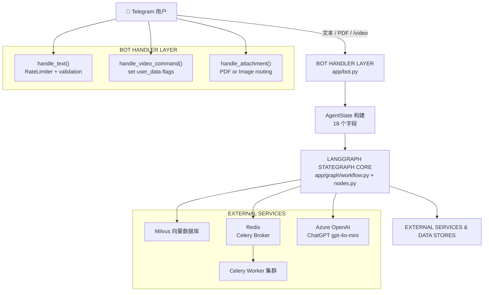
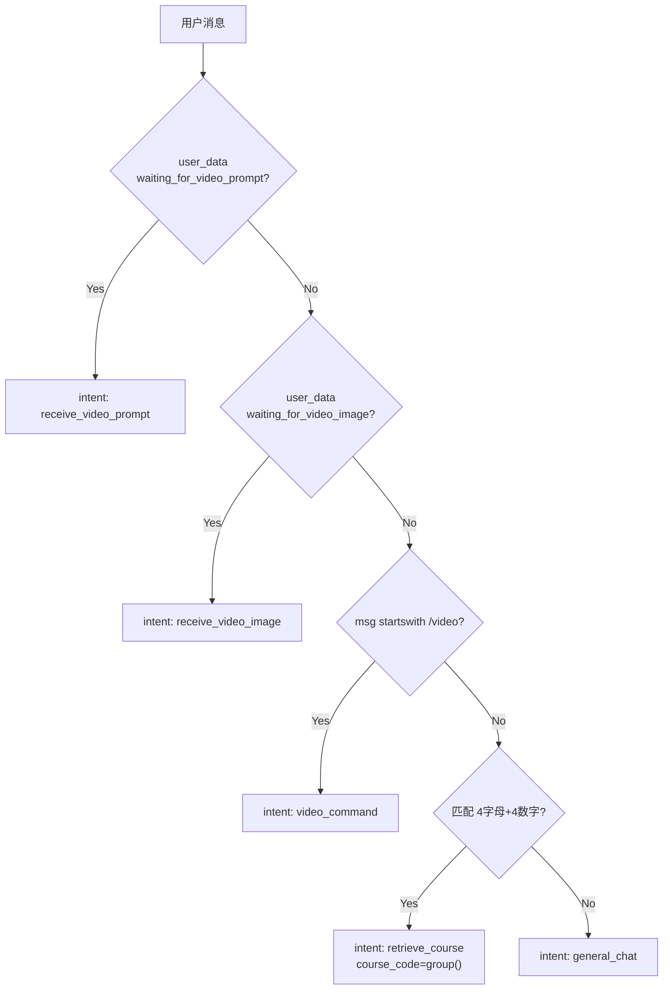
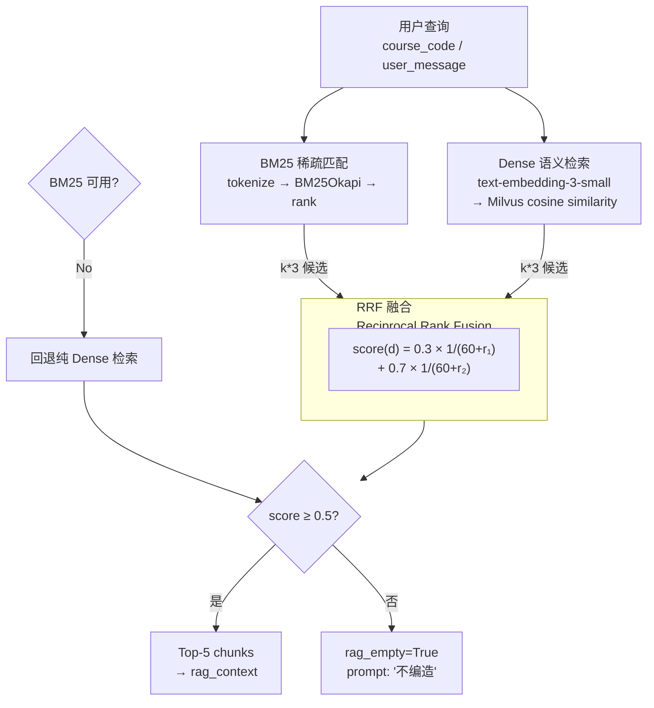
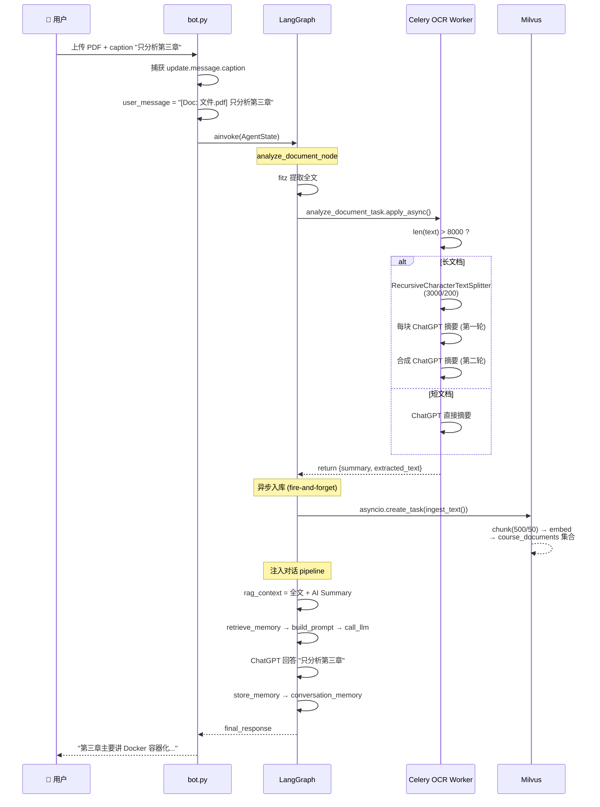
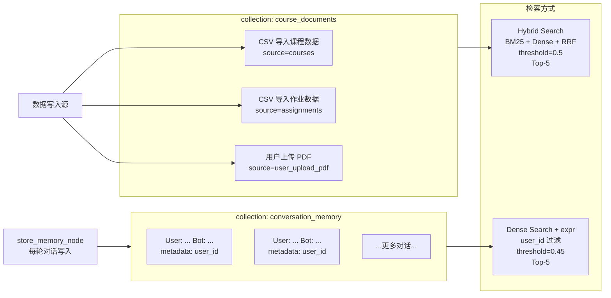
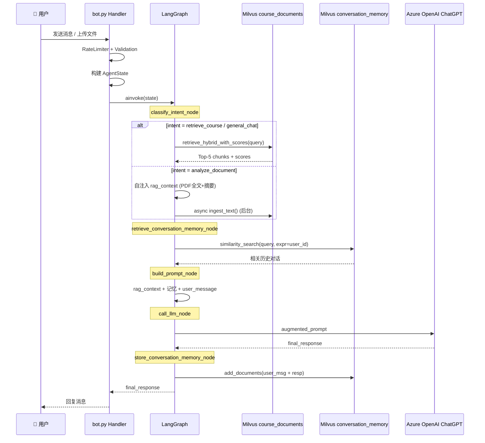
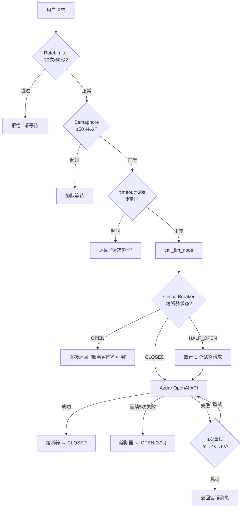
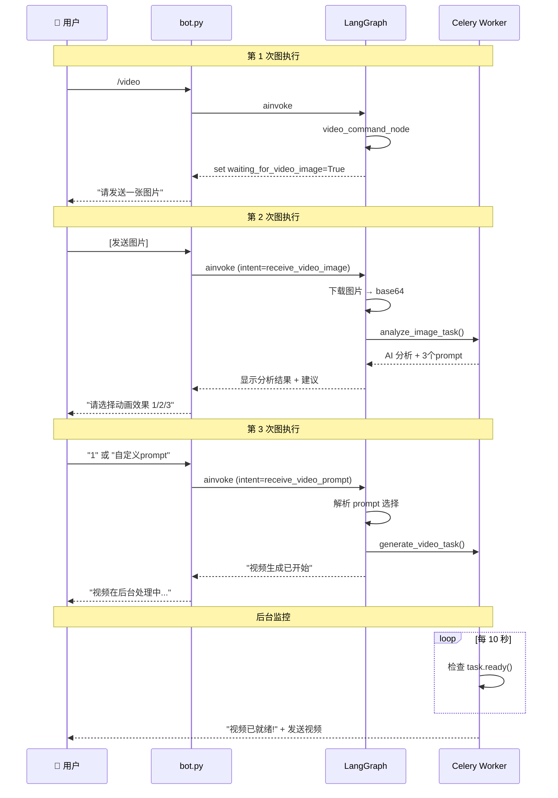

# 项目流程图

> 以下所有流程图使用 Mermaid 语法，GitHub 原生渲染。

---

## 1. 全链路架构总览



---

## 2. LangGraph 核心状态机

```mermaid
flowchart TD
    START["ENTRY"] --> classify["classify_intent_node"]
    
    classify -->|"1. waiting_for_video_prompt"| rvp["receive_video_prompt_node"]
    classify -->|"2. waiting_for_video_image"| rvi["receive_video_image_node"]
    classify -->|"3. /video 命令"| vc["video_command_node"]
    classify -->|4. 匹配 4字母+4数字| retrieve_course["retrieve_rag_node<br/>course_code=匹配值"]
    classify -->|"5. 默认"| general_chat["retrieve_rag_node<br/>user_message 为 query"]

    rvp -->|"Celery 视频生成"| END1["END"]
    rvi -->|"Celery 图片分析"| END2["END"]
    vc -->|"set flags"| END3["END"]

    retrieve_course --> retrieve_mem_c["retrieve_conversation_memory_node"]
    general_chat --> retrieve_mem_c

    retrieve_mem_c --> build["build_prompt_node"]
    build --> call["call_llm_node"]
    call --> store["store_conversation_memory_node"]
    store --> END4["END"]

    %% PDF 分支单独画出
    PDF["PDF 上传<br/>(_route_document_analysis)"] --> doc_node["analyze_document_node"]
    doc_node --> retrieve_mem_c

    %% 虚线标注 shared pipeline
    subgraph Shared["对话共享 Pipeline"]
        retrieve_mem_c
        build
        call
        store
    end

    style Shared fill:'#e6f3ff',stroke:'#333',stroke-dasharray: 5 5
```

---

## 3. 意图分类决策树



---

## 4. 混合检索子系统 (Hybrid Search RAG)



---

## 5. PDF 文档分析子系统



---

## 6. 数据集合架构 (Milvus)



---

## 7. 核心调用链



---

## 8. 限流与容错机制



---

## 9. 视频工作流



---

## 图例

| 符号 | 含义 |
|------|------|
| `[方括号]` | 实体 / 服务 |
| `(圆括号)` | 系统边界 |
| `{菱形}` | 条件判断 |
| `>箭头` | 数据流方向 |
| `---` | 顺序流程 |
| `- - -` | 异步 / 后台流程 |
